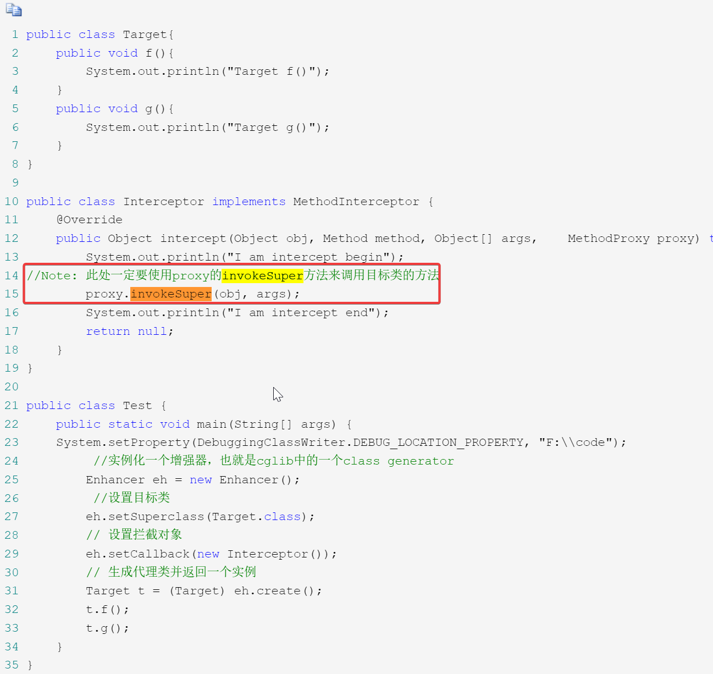

### cglib效率高的核心原因：使用了fastClass机制

Jdk动态代理的拦截对象是通过反射的机制来调用被拦截方法的，反射的效率比较低，所以cglib采用了FastClass的机制来实现对被拦截方法的调用。FastClass机制就是对一个类的方法建立索引，通过索引来直接调用相应的方法
### cglib生成的代理类字节码获取

说一个比较笨的方法可以在断点调试的时候，找到那个存放代理类字节码的字节数组，然后在watches窗口
new FileOutputStream("d:\\代理类名.class").write(b),也就是把它写到硬盘上,但是只有debug结束,该文件才有字节,因为debug阶段,这个字节数组还在内存中,debug结束才将字节数组中的内容刷出

参考地址：https://www.cnblogs.com/cruze/p/3865180.html